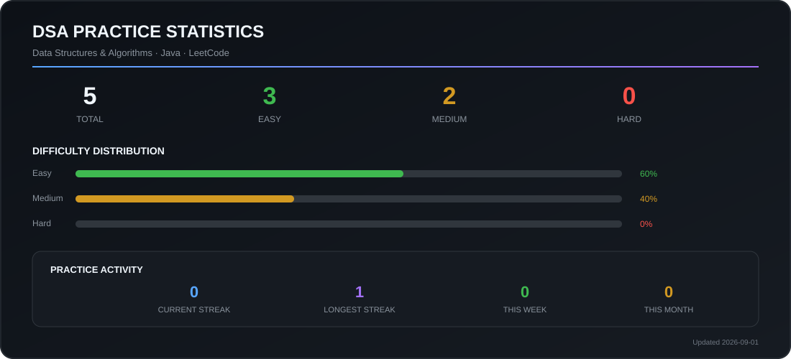

### 📊 DSA Practice Dashboard

---

### 🧩 Problem Areas

**Core Data Structures**

`Arrays` · `Strings` · `Hashing` · `Linked Lists` · `Stacks` · `Queues`

**Algorithmic Techniques**

`Two Pointers` · `Sliding Window` · `Binary Search` · `Recursion` · `Backtracking`

**Advanced Topics**

`Trees` · `Graphs` · `Greedy` · `Dynamic Programming` · `Heaps` · `Sorting`

---

### 🎯 Objectives

- Build strong foundations in Data Structures & Algorithms
- Develop pattern recognition and analytical problem-solving
- Write clean, readable and efficient Java solutions
- Improve understanding of time and space complexity
- Prepare for software engineering technical interviews
- Maintain consistent, measurable coding practice

---

### 💡 Approach

For every problem, the focus is not just on getting an accepted solution, but on understanding:

**Problem → Pattern → Approach → Complexity → Implementation**

Solutions are continuously added as I progress through different DSA concepts.

---

### 🔗 Profiles

[**LeetCode →**](https://leetcode.com/u/221501072/)  
[**LinkedIn →**](https://www.linkedin.com/in/madhumitha-m-257987257/)

---

**Learning continuously. Solving deliberately. Building consistently.**

